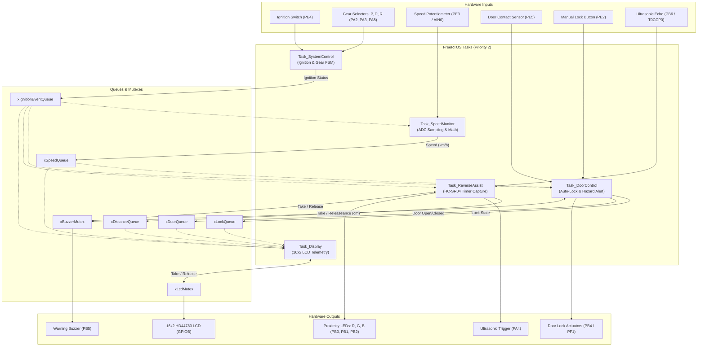

# Automotive Smart Safety System (FreeRTOS)

[](https://www.ti.com/product/TM4C123GH6PM)
[](https://developer.arm.com/Processors/Cortex-M4)
[-green.svg)](https://www.freertos.org/)
[](https://www.keil.com/)
[](https://developer.arm.com/tools-and-software/embedded/arm-compiler)
[](LICENSE)

An automotive-grade, real-time safety monitoring and driver assistance system implemented on the **Texas Instruments TM4C123GH6PM** (ARM Cortex-M4F) microcontroller using **FreeRTOS**.

The system demonstrates deterministic, safety-critical embedded software engineering: orchestrating multi-position transmission management, dynamic throttle and speed acquisition, intelligent automatic door locking, door ajar hazard alerts, ultrasonic reverse obstacle radar with multi-tier audio/visual warnings, and thread-safe LCD driver telemetry.

---

## Table of Contents
- [System Architecture](#system-architecture)
- [Project Directory Layout](#project-directory-layout)
- [Key Features & Real-Time Tasks](#key-features--real-time-tasks)
- [Inter-Task Communication (IPC)](#inter-task-communication-ipc)
- [Hardware Pinout & Wiring](#hardware-pinout--wiring)
- [Hardware Bill of Materials (BOM)](#hardware-bill-of-materials-bom)
- [Getting Started](#getting-started)
  - [Prerequisites](#prerequisites)
  - [Building and Flashing with Keil uVision](#building-and-flashing-with-keil-uvision)
  - [Debugging & ITM Console](#debugging--itm-console)
- [Testing & Operation Guide](#testing--operation-guide)
- [Hardware Drivers & Extensions](#hardware-drivers--extensions)
- [License](#license)

---

## System Architecture

The firmware utilizes a preemptive, priority-based FreeRTOS scheduler to deliver responsive, concurrent execution across independent vehicle submodules. Queues provide thread-safe, non-blocking telemetry distribution, while binary semaphores/mutexes ensure strictly serialized access to shared physical peripherals (Buzzer and LCD).



---

## Project Directory Layout

The project follows a modular, industry-standard embedded C layout:

```
RTOS_project/
├── .gitignore                      # Clean ignore rules for Keil, ARM Compiler & IDE files
├── LICENSE                         # MIT Open-Source License
├── README.md                       # Comprehensive documentation & architecture reference
│
├── src/                            # Application Source Code (.c)
│   ├── main.c                     # System entry point & FreeRTOS task initialization
│   ├── tasks/                     # Real-time task implementations
│   │   ├── Task_SystemControl.c   # Transmission state machine & ignition monitor
│   │   ├── Task_SpeedMonitor.c    # ADC0 throttle sampling & speed conversion
│   │   ├── Task_DoorControl.c     # Door sensor, auto-locking, & hazard alerts
│   │   ├── Task_ReverseAssist.c   # HC-SR04 timer capture & proximity logic
│   │   └── Task_Display.c         # 16x2 HD44780 4-bit LCD driver & telemetry
│   └── utils/                     # Diagnostic & utility functions
│       ├── basic_io.c             # FreeRTOS debug console utilities
│       ├── consoleprint.c         # Semihosting print helpers
│       └── retarget.c             # ITM (printf viewer) serial retargeting
│
├── include/                        # Application & Architecture Headers (.h)
│   ├── Task_SystemControl.h       # Gear states, transmission types, global variables
│   ├── Task_Display.h             # LCD driver macros, delay prototypes
│   ├── basic_io.h                 # FreeRTOS console I/O interfaces
│   ├── consoleprint.h             # Console debug function declarations
│   └── ti/                        # Texas Instruments register & memory maps
│       ├── hw_memmap.h            # Peripheral base memory addresses
│       ├── hw_sysctl.h            # System control register bit definitions
│       └── hw_types.h             # Hardware access macro definitions
│
├── drivers/                        # Hardware Peripheral & Sensor Drivers
│   ├── README.md                  # Driver specifications & usage notes
│   ├── mpu6050.c / .h             # InvenSense MPU-6050 6-Axis IMU driver
│   ├── i2c3_driver.c / .h         # TM4C123 hardware I2C3 master driver (PD0/PD1)
│   └── test/                      # Standalone test benches & bring-up files
│       ├── i2c_test.c             # Register-level I2C test bench
│       └── i2c_test.h             # Test bench header
│
└── keil/                           # Keil MDK-ARM Project Workspace
    ├── Project.uvprojx             # Keil uVision 5 project file (configured groups & paths)
    ├── Project.uvoptx             # Project debugger & target options
    ├── EventRecorderStub.scvd      # Keil Event Recorder description file
    ├── Objects/                   # Compiler object files (.gitkeep)
    ├── Listings/                  # Linker map files (.gitkeep)
    └── RTE/                       # Keil Run-Time Environment
        ├── Device/TM4C123GH6PM/   # Startup assembly & CMSIS system initialization
        ├── RTOS/                  # FreeRTOSConfig.h & CMSIS-RTOS2 interface
        └── _Target_1/             # Generated RTE_Components.h
```

---

## Key Features & Real-Time Tasks

### 1. Transmission & System Controller (`src/tasks/Task_SystemControl.c`)
- **Periodicity:** 100 ms | **Stack:** 128 words
- **Safety Interlock:** Continuously samples ignition pin `PE4` (Active Low) and multi-position gear inputs `PA2` (Park), `PA3` (Drive), and `PA5` (Reverse).
- Dispatches system ignition status to `xIgnitionEventQueue`. When ignition is OFF, all motion-related subsystems remain safely dormant.

### 2. Speed Monitoring & Throttle Acquisition (`src/tasks/Task_SpeedMonitor.c`)
- **Periodicity:** 200 ms | **Stack:** 128 words
- **Gated Execution:** Activates only when ignition is active and transmission is in **Drive** (`GEAR_DRIVE`).
- Samples 12-bit ADC0 (Sequencer 3, channel `AIN0` on `PE3`) connected to a throttle/speed potentiometer.
- Computes vehicle speed ($0 - 180\text{ km/h}$) and broadcasts telemetry via `xSpeedQueue`.

### 3. Intelligent Door Control & Safety Interlocks (`src/tasks/Task_DoorControl.c`)
- **Periodicity:** 100 ms | **Stack:** 128 words
- **Manual Control:** Reads manual lock toggle button on `PE2` and door contact sensor on `PE5`.
- **Auto-Lock Safety:** Automatically triggers door locking (`PB4` / `PF1`) once vehicle speed exceeds **$100\text{ km/h}$** (`SPEED_THRESHOLD_KPH`).
- **Door Ajar Hazard Alert:** If doors are opened while traveling at speeds $> 100\text{ km/h}$, an urgent audible alert is pulsed on buzzer (`PB5`) via `xBuzzerMutex`.

### 4. Ultrasonic Reverse Radar & Proximity Assist (`src/tasks/Task_ReverseAssist.c`)
- **Stack:** 256 words
- **Gated Execution:** Activates only when shifted into **Reverse** (`GEAR_REVERSE`).
- Generates a precise $10\ \mu\text{s}$ ultrasonic trigger pulse on `PA4` utilizing a microsecond hardware timer (`Timer 1`).
- Measures echo pulse duration on `PB6` using **Timer 0A in edge-time capture mode** (`T0CCP0`), calculating obstacle distance in centimeters:
  $$\text{Distance (cm)} = \frac{\Delta\text{TimerTicks} \times 34}{100000}$$
- **Multi-Tier Audio/Visual Warning Zones:**
  | Distance Zone | Distance Range | LED Indicator | Buzzer Behavior |
  |---|---|---|---|
  | **Safe Zone** | $> 30\text{ cm}$ | Green (`PB1`) | Silent |
  | **Caution Zone** | $10\text{ cm} - 30\text{ cm}$ | Blue / Yellow (`PB1` + `PB0`) | Moderate Beeping ($300\text{ ms}$ ON / $300\text{ ms}$ OFF) |
  | **Danger Zone** | $\le 10\text{ cm}$ | Red (`PB0`) | Urgent Rapid Beeping ($100\text{ ms}$ ON / $100\text{ ms}$ OFF) |

### 5. Multi-Information Telemetry Display (`src/tasks/Task_Display.c`)
- **Periodicity:** 1000 ms | **Stack:** 128 words
- Drives a $16 \times 2$ HD44780 LCD in 4-bit parallel mode via Port B, synchronized via `xLcdMutex`.
- **Line 1:** Real-time door status:
  - `LOCKED CLOSED`, `LOCKED OPENED`, `UNLOCKED CLOSED`, `UNLOCKED OPENED`
- **Line 2:** Context-sensitive vehicle metrics:
  - **Drive:** `Gear:D S:<speed>km/h`
  - **Park:** `Gear:P Ign:ON` or `Gear:P Ign:OFF`
  - **Reverse:** `Gear:R D:<distance>m` (or cm)

---

## Inter-Task Communication (IPC)

| IPC Primitive | Type | Size / Type | Producer Task | Consumer Task(s) | Role |
|---|---|---|---|---|---|
| `xIgnitionEventQueue` | Queue | 1 element (`bool`) | `Task_SystemControl` | All Tasks | Distributes ignition state |
| `xSpeedQueue` | Queue | 1 element (`uint16_t`) | `Task_SpeedMonitor` | `Task_DoorControl`, `Task_Display` | Passes vehicle speed ($0-180\text{ km/h}$) |
| `xDistanceQueue` | Queue | 1 element (`uint32_t`) | `Task_ReverseAssist` | `Task_Display` | Passes obstacle distance in cm |
| `xLockQueue` | Queue | 1 element (`bool`) | `Task_DoorControl` | `Task_Display` | Passes lock status |
| `xDoorQueue` | Queue | 1 element (`bool`) | `Task_DoorControl` | `Task_Display` | Passes door open/closed status |
| `xBuzzerMutex` | Mutex | Binary Semaphore | `Task_DoorControl`, `Task_ReverseAssist` | Shared Actuator | Prevents buzzer contention between tasks |
| `xLcdMutex` | Mutex | Binary Semaphore | `Task_Display` | Shared Bus | Serializes 4-bit LCD bus operations |

---

## Hardware Pinout & Wiring

| Pin | Direction | Peripheral Mode | Connected Component | Function / Notes |
|---|---|---|---|---|
| **PE4** | Input | GPIO (Pull-Up) | Ignition Switch / Button | Active-Low ignition signal (`0` = Ignition ON) |
| **PA2** | Input | GPIO (Pull-Up) | Gear Switch: Park | Active-Low transmission selector |
| **PA3** | Input | GPIO (Pull-Up) | Gear Switch: Drive | Active-Low transmission selector |
| **PA5** | Input | GPIO (Pull-Up) | Gear Switch: Reverse | Active-Low transmission selector |
| **PE3** | Input | ADC0 Channel 0 (`AIN0`) | Potentiometer wiper | Vehicle speed / throttle analog input ($0 - 3.3\text{V}$) |
| **PE2** | Input | GPIO (Pull-Up) | Push Button | Manual door lock request |
| **PE5** | Input | GPIO | Limit switch / sensor | Door contact sensor (`1` = closed, `0` = open) |
| **PB4** | Output | GPIO | Lock Actuator Relay | Door lock actuator control signal |
| **PF1** | Output | GPIO (RGB Red) | Onboard LaunchPad LED | Door lock status indicator |
| **PB5** | Output | GPIO | Active Buzzer | Shared acoustic hazard transducer |
| **PA4** | Output | GPIO | HC-SR04 Trigger | $10\ \mu\text{s}$ ultrasonic pulse trigger |
| **PB6** | Input | Timer 0A (`T0CCP0`) | HC-SR04 Echo | Hardware input capture for pulse measurement |
| **PB0** | Output | GPIO | Red LED / LCD RS | Reverse proximity: Danger / LCD RS control |
| **PB1** | Output | GPIO | Green LED / LCD EN | Reverse proximity: Safe / LCD EN control |
| **PB2** | Output | GPIO | Blue LED | Reverse proximity: Caution indicator |
| **PB4 - PB7** | Output | GPIO | 16x2 LCD Data D4-D7 | Upper nibble parallel LCD data transfer |

---

## Hardware Bill of Materials (BOM)

| Component | Quantity | Specification / Description |
|---|---|---|
| **Microcontroller Board** | 1 | Texas Instruments Tiva C Series TM4C123G LaunchPad (`EK-TM4C123GXL`) |
| **Ultrasonic Sensor** | 1 | HC-SR04 or compatible 5V/3.3V module (requires voltage divider on Echo) |
| **Speed Potentiometer** | 1 | $10\text{k}\Omega$ linear potentiometer (wired between $3.3\text{V}$ and GND) |
| **Push Buttons / Switches** | 5 | Momentary or SPST toggle switches (Ignition, Gears P/D/R, Lock) |
| **Audible Indicator** | 1 | 3.3V/5V active buzzer module |
| **LED Indicators** | 3 | Red, Green, Blue discrete LEDs (with $220\Omega$ current-limiting resistors) |
| **Display** | 1 | HD44780-compatible $16 \times 2$ character LCD (with $10\text{k}\Omega$ contrast pot) |
| **Prototyping** | - | Breadboard, jumper wires, USB-A to Micro-B programming cable |

---

## Getting Started

### Prerequisites
1. **Keil MDK (uVision 5):** Version 5.38 or later.
2. **ARM Compiler:** Arm Compiler 6 (armclang).
3. **Keil Device Family Pack (DFP):** `Keil::TM4C_DFP` (v1.1.0 or newer).
4. **CMSIS FreeRTOS Pack:** `ARM::CMSIS-FreeRTOS` (v11.1.0 or newer).
5. **Drivers:** TI Stellaris ICDI USB drivers installed on Windows.

### Building and Flashing with Keil uVision
1. Clone this repository:
   ```bash
   git clone https://github.com/<your-username>/<your-repo-name>.git
   cd <your-repo-name>
   ```
2. Launch Keil uVision 5 and open `keil/Project.uvprojx`.
3. If prompted by the Keil Pack Installer, allow it to download missing packs (`TM4C_DFP` and `CMSIS-FreeRTOS`).
4. Build the project:
   - Press **`F7`** or click **Project -> Build Target**.
   - Verify zero errors and zero warnings. All build artifacts are cleanly directed into `keil/Objects/`.
5. Connect your TM4C123G LaunchPad to your PC via the **In-Circuit Debug Interface (ICDI)** USB port.
6. Flash firmware onto the microcontroller:
   - Press **`F8`** or click **Flash -> Download**.

### Debugging & ITM Console
- Enter the debug session by pressing **`Ctrl + F5`**.
- Enable printf output via Instrumentation Trace Macrocell (ITM):
  - In Keil debug mode, navigate to **View -> Serial Windows -> Debug (printf) Viewer**.
  - All standard output routed via `src/utils/retarget.c` will appear live in this console.

---

## Testing & Operation Guide

Follow these testing scenarios to verify each subsystem:

1. **Ignition Test:**
   - With `PE4` open (High / Pull-up), ignition is OFF. Verify that changing gears or adjusting the speed potentiometer produces no actuator activity.
   - Ground `PE4` (Active Low). Verify ignition ON state.
2. **Transmission & Speed Monitoring:**
   - Pull `PA3` to ground to enter **Drive** (`GEAR_DRIVE`).
   - Rotate the potentiometer on `PE3`. Observe the speed calculation updating smoothly between $0$ and $180\text{ km/h}$.
3. **Auto-Lock Verification:**
   - While in Drive, increase the potentiometer until calculated speed exceeds $100\text{ km/h}$.
   - Verify that `PB4` and `PF1` switch ON immediately (doors locked).
4. **Door Ajar Hazard Alarm:**
   - Keep speed above $100\text{ km/h}$ and disconnect `PE5` from $3.3\text{V}$ (simulating an open door while driving).
   - Verify that the buzzer (`PB5`) sounds continuous warning pulses until the door is closed or speed decreases below $100\text{ km/h}$.
5. **Ultrasonic Reverse Radar:**
   - Ground `PA5` to shift into **Reverse** (`GEAR_REVERSE`).
   - Move an obstacle toward the HC-SR04 sensor:
     - At $> 30\text{ cm}$: Green LED (`PB1`) is lit, buzzer is silent.
     - At $15\text{ cm}$: Blue LED (`PB2`/`PB1`+`PB0`) lights up, buzzer pulses with a $300\text{ ms}$ cadence.
     - At $< 10\text{ cm}$: Red LED (`PB0`) lights up, buzzer sounds an urgent $100\text{ ms}$ high-frequency beep.

---

## Hardware Drivers & Extensions

The repository includes supplementary drivers inside [`drivers/`](drivers/) for integrating an InvenSense **MPU-6050 6-Axis MotionTracking IMU** (3-axis gyroscope + 3-axis accelerometer) via `I2C3` (`PD0` SCL, `PD1` SDA).

This enables extended capabilities:
- Vehicle rollover and severe tilt angle detection.
- Impact / crash detection via multi-axis g-force acceleration spikes.
- Emergency automatic door unlocking upon collision impact.

Refer to [`drivers/README.md`](drivers/README.md) for wiring and integration steps.
